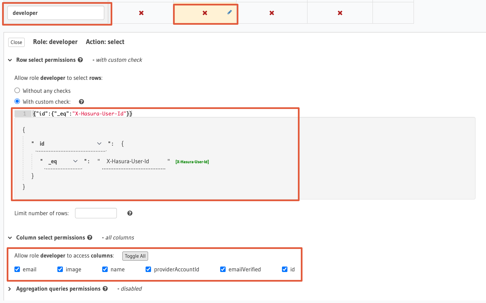

# Express.js + SAML Jackson SSO + Hasura GraphQL Integration Example

This demo app shows how to use SAML Jackson with Hasura GraphQL for authentication.

## Overview

The example Express.js app runs on port 3366.

Postgres and Hasura are running on port 5432 and 8081 respectively within Docker containers.

This demo is configured to work with 2 `x-hasura-role` (admin, developer).

`admin` can see all the rows in the users table. `developer` can see their own row. If no role is provided the `developer` role is assumed.

## Setup the app

Please follow the below instructions.

### Install dependencies

```bash
npm install
```

### Setup Environment

Update `apps/hasura-express/.env` with your own credentials.

### Run the app

```bash
npm run dev:hasura-express
```

### Setup Hasura GraphQL

- Open Hasura Console at [http://localhost:8081/console](http://localhost:8081/console)
- Configure your database connection
- Click `SQL` from the left menu
- Paste the following SQL into the editor. This will create the `users` table with required columns

```sql
CREATE EXTENSION IF NOT EXISTS pgcrypto;

SET check_function_bodies = false;

CREATE TABLE public.users (
  id uuid DEFAULT public.gen_random_uuid() NOT NULL,
  name text,
  email text,
  "providerAccountId" text NOT NULL,
  "emailVerified" timestamp with time zone,
  image text
);

ALTER TABLE ONLY public.users
    ADD CONSTRAINT users_email_key UNIQUE (email);

ALTER TABLE ONLY public.users
    ADD CONSTRAINT users_pkey PRIMARY KEY (id);
```

### Configure Hasura Permissions

Add an additional role `developer` to the `users` table as follows. The demo will throw an error if you don't have this role.



## Contributing

Thanks for taking the time to contribute! Contributions are what make the open-source community such an amazing place to learn, inspire, and create. Any contributions you make will benefit everybody and are very appreciated.

Please try to create bug reports that are:

- _Reproducible._ Include steps to reproduce the problem.
- _Specific._ Include as much detail as possible: which version, what environment, etc.
- _Unique._ Do not duplicate existing opened issues.
- _Scoped to a Single Bug._ One bug per report.

## Community

- [Discord](https://discord.gg/uyb7pYt4Pa) (For live discussion with the Community and BoxyHQ team)
- [Twitter](https://twitter.com/BoxyHQ) (Get the news fast)
