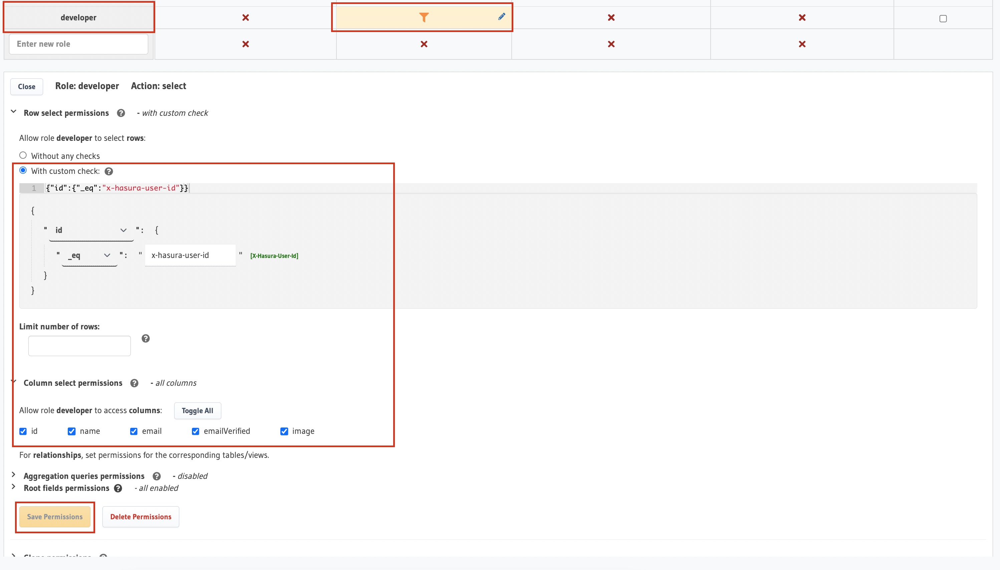

# Next.js + Enterprise SSO + Hasura GraphQL Integration Example

This demo app shows how to use BoxyHQ SAML Jackson with Hasura GraphQL for authentication.

## Overview

The example Next.js app runs on port 3366.

Postgres and Hasura are running on port 5432 and 8081 respectively within Docker containers.

This demo is configured to work with 2 `x-hasura-role` (admin, developer).

`admin` can see all the rows in the users table. `developer` can see their own row. If no role is provided the `developer` role is assumed.

## Setup Environment

Update `.env` with your own credentials.

Run `npm run dev-docker` from `/apps/hasura-nextjs` to start the Postgres, Hasura and BoxyHQ (Jackson) Docker containers.

### Setup SAML Jackson

`.env` is pre-configured to work with a local version of SAML Jackson (and included in the Docker Compose setup). Feel free to change the `BOXYHQ_SAML_JACKSON_URL` to point to your own hosted version of SAML Jackson.

### Configure SAML application in an Identity Provider

You can use our Mock SAML IdP if you do not have access to a real Identity Provider like Azure AD or Okta. You will setup the SAML connection in BoxyHQ using API calls.

For Mock SAML use the following curl command:

```bash
curl --location --request POST 'http://localhost:5225/api/v1/saml/config' \
--header 'Authorization: Api-Key secret' \
--header 'Content-Type: application/x-www-form-urlencoded' \
--data-urlencode 'defaultRedirectUrl=http://localhost:3366/login/saml' \
--data-urlencode 'redirectUrl=["http://localhost:3366/*"]' \
--data-urlencode 'tenant=example.com' \
--data-urlencode 'product=hasura-nextjs' \
--data-urlencode 'encodedRawMetadata=PG1kOkVudGl0eURlc2NyaXB0b3IgeG1sbnM6bWQ9InVybjpvYXNpczpuYW1lczp0YzpTQU1MOjIuMDptZXRhZGF0YSIgZW50aXR5SUQ9Imh0dHBzOi8vc2FtbC5leGFtcGxlLmNvbS9lbnRpdHlpZCIgdmFsaWRVbnRpbD0iMjAzMi0xMS0yMVQwMTowMDowMS41NDlaIj4KPG1kOklEUFNTT0Rlc2NyaXB0b3IgV2FudEF1dGhuUmVxdWVzdHNTaWduZWQ9ImZhbHNlIiBwcm90b2NvbFN1cHBvcnRFbnVtZXJhdGlvbj0idXJuOm9hc2lzOm5hbWVzOnRjOlNBTUw6Mi4wOnByb3RvY29sIj4KPG1kOktleURlc2NyaXB0b3IgdXNlPSJzaWduaW5nIj4KPGRzOktleUluZm8geG1sbnM6ZHM9Imh0dHA6Ly93d3cudzMub3JnLzIwMDAvMDkveG1sZHNpZyMiPgo8ZHM6WDUwOURhdGE+CjxkczpYNTA5Q2VydGlmaWNhdGU+TUlJQzRqQ0NBY29DQ1FDMzN3bnliVDVRWkRBTkJna3Foa2lHOXcwQkFRc0ZBREF5TVFzd0NRWURWUVFHRXdKViBTekVQTUEwR0ExVUVDZ3dHUW05NGVVaFJNUkl3RUFZRFZRUUREQWxOYjJOcklGTkJUVXd3SUJjTk1qSXdNakk0IE1qRTBOak00V2hnUE16QXlNVEEzTURFeU1UUTJNemhhTURJeEN6QUpCZ05WQkFZVEFsVkxNUTh3RFFZRFZRUUsgREFaQ2IzaDVTRkV4RWpBUUJnTlZCQU1NQ1Uxdlkyc2dVMEZOVERDQ0FTSXdEUVlKS29aSWh2Y05BUUVCQlFBRCBnZ0VQQURDQ0FRb0NnZ0VCQUxHZllldHRNc2N0MVQ2dFZVd1R1ZE5KSDVQbmI5R0dua1hpOVp3L2U2eDQ1REQwIFJ1Uk9OYkZsSjJUNFJqQUUvdUcrQWpYeFhROG8yU1pmYjkrR2dtQ0h1VEpGTmdIb1oxbkZWWENtYi9IZzhIcGQgNHZPQUdYbmRpeGFSZU9pcTNFSDVYdnBNak1rSjMrOCs5VllNek1aT2prZ1F0QXFPMzZlQUZGZk5LWDdkVGozViBwd0xrdno2L0tGQ3E4T0F3WStBVWk0ZVptNUo1N0QzMUd6akh3ZmpIOVdUZVgwTXluZG1uTkIxcVY3NXFRUjNiIDIvVzVzR0hSdis5QWFyZ2dKa0YrcHRVa1hvTHRWQTUxd2NmWW02aElMcHRwZGU1RlFDOFJXWTFZcnN3QldBRVogTmZ5clI0SmVTd2VFbE5IZzROVk9zNFR3R2pPUHdXR3F6VGZnVGxFQ0F3RUFBVEFOQmdrcWhraUc5dzBCQVFzRiBBQU9DQVFFQUFZUmxZZmxTWEFXb1pwRmZ3TmlDUVZFNWQ5elowRFB6TmRXaEF5YlhjVHlNZjB6NW1EZjZGV0JXIDVHeW9pOXUzRU1FRG56TGNKTmt3SkFBYzM5QXBhNEkyL3RtbCtKeTI5ZGs4YlR5WDZtOTNuZ21DZ2RMaDVaYTQga2h1VTNBTTNMNjNnN1ZleEN1Tzdrd2tqaC8rTHFkY0lYc1ZHTzZYRGZ1MlFPczFYcGU5ekl6THB3bS9STlllWCBVamJTajVjZS9qZWtwQXc3cXlWVkw0eE95aDhBdFVXMWVrM3dJdzFNSnZFZ0VQdDBkMTZvc2hXSnBvUzFPVDhMIHIvMjJTdllFbzNFbVNHZFRWR2drM3gzcytBMHFXQXFUY3lqcjdRNHMvR0tZUkZmb21Hd3owVFo0SXcxWk45OU0gbTBlbzJVU2xTUlRWbDdRSFJUdWl1U1RoSHBMS1FRPT0gPC9kczpYNTA5Q2VydGlmaWNhdGU+CjwvZHM6WDUwOURhdGE+CjwvZHM6S2V5SW5mbz4KPC9tZDpLZXlEZXNjcmlwdG9yPgo8bWQ6TmFtZUlERm9ybWF0PnVybjpvYXNpczpuYW1lczp0YzpTQU1MOjEuMTpuYW1laWQtZm9ybWF0OmVtYWlsQWRkcmVzczwvbWQ6TmFtZUlERm9ybWF0Pgo8bWQ6U2luZ2xlU2lnbk9uU2VydmljZSBCaW5kaW5nPSJ1cm46b2FzaXM6bmFtZXM6dGM6U0FNTDoyLjA6YmluZGluZ3M6SFRUUC1SZWRpcmVjdCIgTG9jYXRpb249Imh0dHBzOi8vbW9ja3NhbWwuY29tL2FwaS9zYW1sL3NzbyIvPgo8bWQ6U2luZ2xlU2lnbk9uU2VydmljZSBCaW5kaW5nPSJ1cm46b2FzaXM6bmFtZXM6dGM6U0FNTDoyLjA6YmluZGluZ3M6SFRUUC1QT1NUIiBMb2NhdGlvbj0iaHR0cHM6Ly9tb2Nrc2FtbC5jb20vYXBpL3NhbWwvc3NvIi8+CjwvbWQ6SURQU1NPRGVzY3JpcHRvcj4KPC9tZDpFbnRpdHlEZXNjcmlwdG9yPg=='
```

For Azure AD or other Identity Providers use the following curl command (same as above) but replace `encodedRawMetadata` with the base64 encoded value of the SAML metadata file you download.

```bash
curl --location --request POST 'http://localhost:5225/api/v1/connections' \
--header 'Authorization: Api-Key secret' \
--header 'Content-Type: application/x-www-form-urlencoded' \
--data-urlencode 'defaultRedirectUrl=http://localhost:3366/login/saml' \
--data-urlencode 'redirectUrl=["http://localhost:3366/*", "http://localhost:3001/*"]' \
--data-urlencode 'tenant=boxyhq.com' \
--data-urlencode 'product=hasura-nextjs' \
--data-urlencode 'encodedRawMetadata=<base64 encoded string of the SAML metadata file contents>'
```

### Setup Hasura GraphQL

Open Hasura Console at [http://localhost:8081/console](http://localhost:8081/console). Use the `HASURA_GRAPHQL_ADMIN_SECRET` value from `docker-compose.yml`

#### Add Required Tables

In the Hasura Console, we use the **Raw SQL** feature to add the tables [NextAuth.js needs](https://github.com/skillrecordings/products/tree/main/packages/next-auth-hasura-adapter#overview).

Navigate to `DATA` tab -> Enter the database connection parameters -> Connect to the database -> Click on `SQL` tab -> Paste the below sql snippet in the editor -> Click Run.

```sql
CREATE EXTENSION IF NOT EXISTS pgcrypto;
SET check_function_bodies = false;
CREATE TABLE public.accounts (
    id uuid DEFAULT public.gen_random_uuid() NOT NULL,
    type text NOT NULL,
    provider text NOT NULL,
    "providerAccountId" text NOT NULL,
    refresh_token text,
    access_token text,
    expires_at bigint,
    token_type text,
    scope text,
    id_token text,
    session_state text,
    oauth_token_secret text,
    oauth_token text,
    "userId" uuid NOT NULL,
    refresh_token_expires_in integer
);
CREATE TABLE public.sessions (
    id uuid DEFAULT public.gen_random_uuid() NOT NULL,
    "sessionToken" text NOT NULL,
    "userId" uuid NOT NULL,
    expires timestamp with time zone
);
CREATE TABLE public.users (
    id uuid DEFAULT public.gen_random_uuid() NOT NULL,
    name text,
    email text,
    "emailVerified" timestamp with time zone,
    image text
);
CREATE TABLE public.verification_tokens (
    token text NOT NULL,
    identifier text NOT NULL,
    expires timestamp with time zone
);
ALTER TABLE ONLY public.accounts
    ADD CONSTRAINT accounts_pkey PRIMARY KEY (id);
ALTER TABLE ONLY public.sessions
    ADD CONSTRAINT sessions_pkey PRIMARY KEY (id);
ALTER TABLE ONLY public.users
    ADD CONSTRAINT users_email_key UNIQUE (email);
ALTER TABLE ONLY public.users
    ADD CONSTRAINT users_pkey PRIMARY KEY (id);
ALTER TABLE ONLY public.verification_tokens
    ADD CONSTRAINT verification_tokens_pkey PRIMARY KEY (token);
ALTER TABLE ONLY public.accounts
    ADD CONSTRAINT "accounts_userId_fkey" FOREIGN KEY ("userId") REFERENCES public.users(id) ON UPDATE RESTRICT ON DELETE CASCADE;
ALTER TABLE ONLY public.sessions
    ADD CONSTRAINT "sessions_userId_fkey" FOREIGN KEY ("userId") REFERENCES public.users(id) ON UPDATE RESTRICT ON DELETE CASCADE;
```

#### Track the Tables and Relationships

Make sure you [track the tables](https://hasura.io/docs/latest/graphql/core/databases/postgres/schema/using-existing-database/#to-track-all-tables-and-views-present-in-the-database). Tracking a table means telling Hasura GraphQL engine that you want to expose that table over GraphQL.

- Click on the `public` schema
- Click `Track All` against `Untracked tables or views`
- Click `Track All` against `Untracked foreign-key relationships`

#### Configure Hasura Permissions

Add an additional role `developer` to the `users` table. The Row select permissions are outlined below in the image, also please don't forget to select all for Column select permissions.



### Start the app

Run `npm run dev:hasura-nextjs` to start the app.

Now you can open the example app at [http://localhost:3366/](http://localhost:3366/) and start playing with the app.

### Configure Azure AD (Optional)

You can optionally configure Azure AD to send a `role` along with the user profile and use it as the value for `x-hasura-role` in the claims.

Navigate to `Users and groups` under the SAML application you created earlier, then select the `application registration` link that's in the text just above the users table. The link is highlighted in red in the screenshot below.


Next click on `Create app role` and create two new roles `admin` and `developer`.


Next head back to the `Users and groups` page, select your user from the table and click on `Edit assignment` at the top.


Now click on `Select a role` and then assign the `admin` role.


Now you'll need to ensure that we have a SAML attribute mapping to the role we assigned earlier. Head back to the `SAML setup` page in Azure AD and maps `roles` attribute to `user.assignedroles`.


If you now give it a minute or two to let Azure AD propagate the change, `Sign out` of `http://localhost:3366/` and `Sign in` again you should see the new role reflected now for your user.


If you switch to the `Hasura` tab then you should now see your own record and any other that might exist. A good way to create more records would be to login via Mock SAML by using `demo@examle.com` email in the `Sign In` page.


### Configure Okta (Optional)

You can optionally configure Okta to demonstrate how to pass `groups` along with user profile and use it as the value for `x-hasura-role` in the claims.

Read more about [How to define and configure a custom SAML attribute statement](https://support.okta.com/help/s/article/How-to-define-and-configure-a-custom-SAML-attribute-statement?language=en_US)


## Contributing

Thanks for taking the time to contribute! Contributions are what make the open-source community such an amazing place to learn, inspire, and create. Any contributions you make will benefit everybody and are very appreciated.

Please try to create bug reports that are:

- _Reproducible._ Include steps to reproduce the problem.
- _Specific._ Include as much detail as possible: which version, what environment, etc.
- _Unique._ Do not duplicate existing opened issues.
- _Scoped to a Single Bug._ One bug per report.

## Community

- [Discord](https://discord.gg/uyb7pYt4Pa) (For live discussion with the Community and BoxyHQ team)
- [Twitter](https://twitter.com/BoxyHQ) (Get the news fast)
